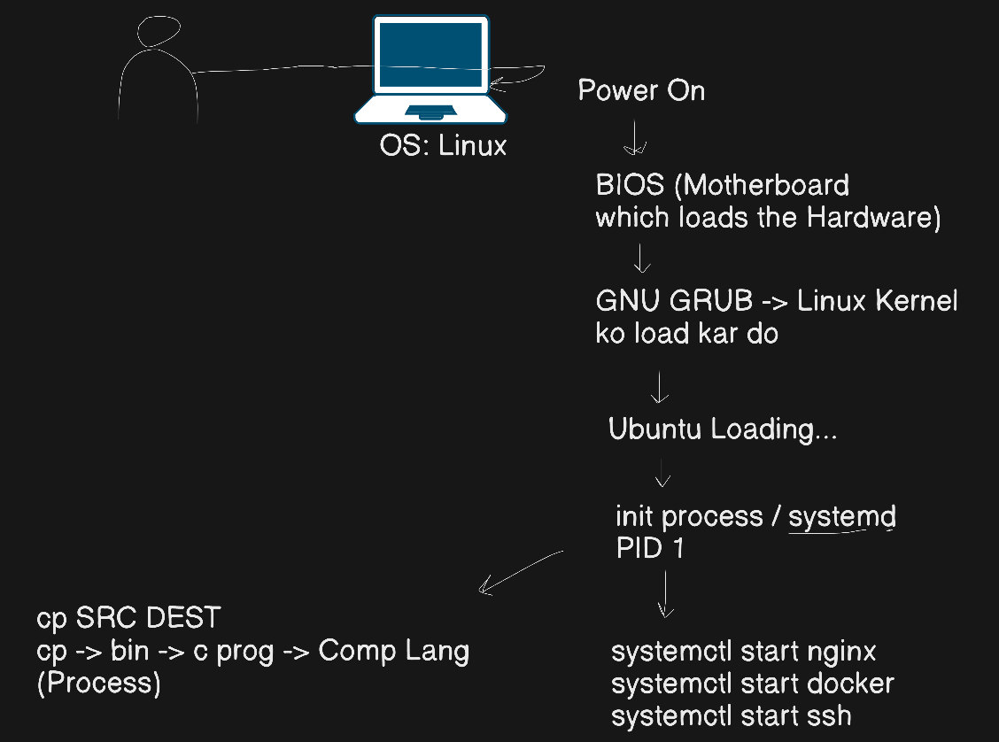

# Linux Fundamentals & Operations Notes

## 🖥️ 1. Introduction to Linux & OS
*   An Operating System (OS) acts as an interface between the user and the computer hardware, managing resources.
*   Common operating systems include Windows, Linux, and Mac OS.
*   **How to access/use Linux:** You can run it via Oracle Virtualbox, Vagrant, Docker images, WSL2 (Windows Sub-system for Linux), Cloud Servers (AWS, Azure, GCP), Dual boot, Online playgrounds like Killercoda, as your Primary OS, or through GitBash.
*   **Popular Linux Flavors/Distributions:** Ubuntu (most commonly used), Fedora, CentOS, and RHEL (RedHat Enterprise).
*   **Ubuntu Release Cycle:** Ubuntu rolls out 2 updates yearly. April releases are LTS (Long Term Support), e.g., 19.04, 24.04; October releases are beta releases, e.g., 19.10, 24.10

---

## 🧅 2. Linux Architecture
Linux follows an "Onion" layered architecture:
*   **Users/Apps** interact with the **Shell**.
*   The **Shell** communicates with the **Kernel**.
*   The **Kernel** (the heart of the Linux OS) manages the physical **Hardware**.

---

## 🚀 3. The Boot Process
Here is the step-by-step process of how Linux boots up:
1.  **Power On**.
2.  **BIOS:** Firmware present in the motherboard that initializes and loads the hardware (performs POST to ensure components work properly).
3.  **GNU GRUB (Bootloader):** Loads the Linux Kernel.
4.  **Ubuntu Loading...**.
5.  **`init` process / `systemd`:** This is the very first process that starts, always having a PID (Process ID) of 1.

### Linux Boot Process Diagram

---

## 📁 4. File System Hierarchy
*"Everything in linux is either a file or a Directory"*. It follows an upside-down tree structure starting from the Root (`/`).
*   **`/etc`:** System configuration files.
*   **`/var/log`:** System and application error logs.
*   **`/bin`:** Essential user binaries/programs.
*   **`/mnt`:** Used to temporarily mount external storage devices and filesystems.
*   **`/etc/fstab`:** File system table used for automounting.

---

## ⌨️ 5. Important Linux Commands & Tools

### Built-in Commands
Commands like `cd`, `echo`, `pwd`, `alias`, and `history` are built into the shell and do not have manual pages.
> *(Note: RTFM stands for "Read the f***ing manual"!)*

### File & Directory Operations
*   `mkdir`: Make a new directory.
*   `touch`: Make a new file or change existing file timestamps.
*   `cp`: Copy a file or directory from source to destination.
*   `mv`: Move a file/directory or rename it.
*   `rm`: Remove a file or directory (`rmdir` for directories).
*   `cat`: Concatenate files and print on the standard output (stdout).

### System & Network Information
*   `ip addr`: Check the IP address of the system.
*   `ping`: Check connectivity and if a host is reachable.
*   `nproc`: Check the number of CPU cores.
*   `free`: Check memory utilization.
*   `df`: Check disk free space.
*   `shutdown -h` or `shutdown -h now`: Power off the Linux OS through the CLI.

### Process Management
*"Everything starts with a process"*.
*   `ps`: Provides a static snapshot of processes at the moment the command is executed.
*   `ps aux`: Shows all processes in BSD syntax.
*   `top`: Provides a dynamic, real-time view of running processes (like Windows Task Manager).
*   > Note: `htop` can be used instead of `top`.*
*   `kill <pid>`: Used to terminate a process.
*   `kill -9 <pid>`: Sends a SIGKILL signal to forcefully terminate a process.

### Advanced Operators & Utilities
*   `|` **(Pipe operator):** Passes the output of one command as the input to another command.
*   `grep` **(Global Regular Expression Print):** Used for pattern-based text matching in a file or output.
    *   *Example:* `ps aux | grep <pattern>` helps find specific running processes.
*   `nohup`: A tool that helps run a script in the background so it keeps running even if the terminal is closed ("no hang up").
*   `&` **operator:** Used to run a command in the background.

---

## ⚙️ 6. Services and Daemons
*   **Daemon:** Any process that runs in the background without user control.
*   **`systemctl`:** The system controller used to manage these services.
    *   `systemctl start <service>` (e.g., `nginx`, `docker`, `ssh`).
    *   `systemctl status <service>`.
    *   `systemctl stop <service>`.
